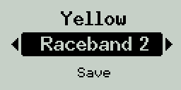
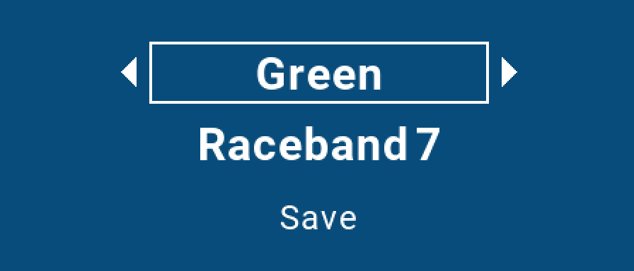

## Lua LED & VTX Switch

Скрипт для переключения каналов видеопередатчика и цвета светодиодов с экрана аппаратуры.

  

### Установка скрипта OpenTX

1) Скачать [zip-архив](https://github.com/alexeystn/lua-vtx-switch/archive/refs/heads/master.zip) и распаковать.
2) Скопировать содержимое папки `SCRIPTS/TOOLS` из архива в папку `SCRIPTS/TOOLS` на SD карте.
3) На аппаратуре открыть меню `TOOLS` (долгим нажатием кнопки `Menu`) и выбрать `LED & VTX setup`
4) *(Опционально)*. Для быстрого доступа к скрипту на экране телеметрии
   1) Положить `ledvtx.lua` из папки `SCRIPTS/TELEMETRY` из архива в папку `SCRIPTS/TELEMETRY` на SD-карте.
   2) В настройках модели на странице `DISPLAY` выбрать `Script: ledvtx` для любого из экранов.  

### Настройка Betaflight

1) Настроить режим светодиодов `set ledstrip_profile = STATUS`.
2) *(Опционально)*. Для более точных оттенков и равномерной яркости свечения можно использовать таблицу цветов:

<details>
  <summary> <i>Таблица</i> </summary>
  
  ```
  color 1 30,100,120
  color 2 0,0,240
  color 3 10,0,220
  color 4 30,0,180
  color 5 90,0,180
  color 6 120,0,240
  color 7 150,0,180
  color 8 180,0,120
  color 9 210,0,180
  color 10 240,0,240
  color 11 270,0,180
  color 12 300,0,120
  color 13 330,0,180
  save
  ```
  
</details>

### Возможные проблемы

* Если изменяется цвет только первого светодиода, поменяйте в файле `SCRIPTS/TOOLS/ledvtx.lua` параметр `ledCount = 1` на нужное количество диодов в ленте.
* Если используется Betaflight 4.4 или более ранняя версия, установите в файле `SCRIPTS/TOOLS/ledvtx.lua` для  параметра `mspApiVersion` значение `45` вместо `46`.
* При совместном использовании с ELRS VTX Administrator при установке видеоканала в скрипте следует выбирать вариант `* * * *`.
