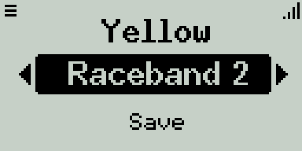
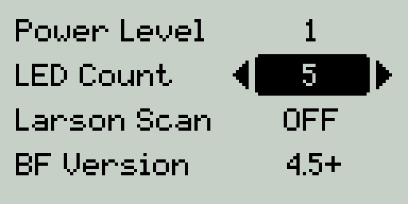
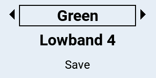
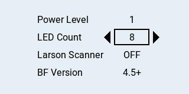

## Lua LED & VTX Switch

Скрипт для переключения каналов видеопередатчика и цвета светодиодов с экрана аппаратуры.

  <br>
  

### Установка скрипта в EdgeTX

1) Скачать содержимое репозитория (Code -> Download ZIP) и распаковать.
2) Скопировать содержимое папки `SCRIPTS/TOOLS` из архива в папку `SCRIPTS/TOOLS` на SD карте.
3) На аппаратуре открыть меню `TOOLS` и выбрать `LED & VTX setup`

### Настройка Betaflight

1) Настроить режим светодиодов в CLI: `set ledstrip_profile = STATUS`.
2) Убедиться, что на вкладке `Receiver` установлен переключатель `Telemetry`.

### Дополнительные опции

В меню настроек скрипта есть параметр `VTX Mode`:

* `MSP` - старый режим работы. Скрипт отправляет `MSP_SET_VTX_CONFIG` напрямую в Betaflight, затем сохраняет настройки через `MSP_EEPROM_WRITE`.
* `ELRS` - новый режим для ExpressLRS VTX Administrator. Скрипт читает текущие `Band/Enable`, `Channel` и `Pwr Lvl` из TX-модуля ELRS, записывает изменения туда же и нажимает `Send VTx`.

В режиме `ELRS` дальнейшую отправку выполняет сам TX-модуль ExpressLRS: он рассылает VTX-настройку на FC/RX и, если это разрешено состоянием модели, отправляет MSP-пакет в ELRS TX Backpack. Отдельная настройка Backpack в скрипте не нужна.

Для `VTX Mode: ELRS` можно выбрать `Power Level: -`. В этом случае TX-модуль ELRS не отправляет уровень мощности в VTX-команде, и видеопередатчик продолжает использовать уровень, заданный в Betaflight. В режиме `MSP` скрипт всегда отправляет валидный power level.

В `VTX Mode: ELRS` изменение VTX-канала или `Power Level` применяется сразу после выхода из списка повторным нажатием `Enter`, как в Lua-скрипте ExpressLRS. Кнопка `Save` по-прежнему отправляет полный набор настроек, включая LED.

Параметр `Bands` выбирает набор каналов в списке VTX. `Analog` показывает все доступные band/channel из скрипта. `HDZero` оставляет только `Raceband 1-8`, `Band E 1`, `Fatshark 1`, `Fatshark 2`, `Fatshark 4` и `Lowband 1-8`. Если TX-модуль ELRS сообщает канал вне выбранного HDZero-списка, скрипт временно показывает этот фактический канал отдельным пунктом, чтобы не потерять текущее состояние VTX Administrator.

LED-настройки в обоих режимах остаются прежними: они отправляются напрямую в Betaflight через MSP.

Для быстрого доступа к скрипту на экране телеметрии в аппаратурах с ч/б дисплеем:
1) Положить `ledvtx.lua` из папки `SCRIPTS/TELEMETRY` из архива в папку `SCRIPTS/TELEMETRY` на SD-карте.
2) В настройках модели на странице `DISPLAY` выбрать `Script: ledvtx` для любого из экранов.  

Для более точных оттенков и равномерной яркости свечения можно использовать таблицу цветов:

<details>
  <summary> <i>Таблица</i> </summary>
  
  ```
  color 1 30,100,120
  color 2 0,0,240
  color 3 10,0,220
  color 4 30,0,180
  color 5 90,0,180
  color 6 120,0,240
  color 7 150,0,180
  color 8 180,0,120
  color 9 210,0,180
  color 10 240,0,240
  color 11 285,0,150
  color 12 350,0,200
  color 13 350,0,200
  save
  ```
  
</details>

### Возможные проблемы

* Если нужно управлять VTX через ELRS VTX Administrator, выберите `VTX Mode: ELRS`. В режиме `MSP` скрипт работает как старая версия и не синхронизирует выбранный канал с TX-модулем.
* В режиме `ELRS` канал в меню может автоматически измениться на текущий канал из TX-модуля. Это сделано специально, чтобы скрипт показывал фактическое состояние VTX Administrator.
* На SPI-приёмниках при большом значении LED count светодиоды могут переключаться не все с первого раза.
* Предыдущая стабильная версия скрипта: [1.0](https://github.com/alexeystn/lua-vtx-switch/tree/1.0)
